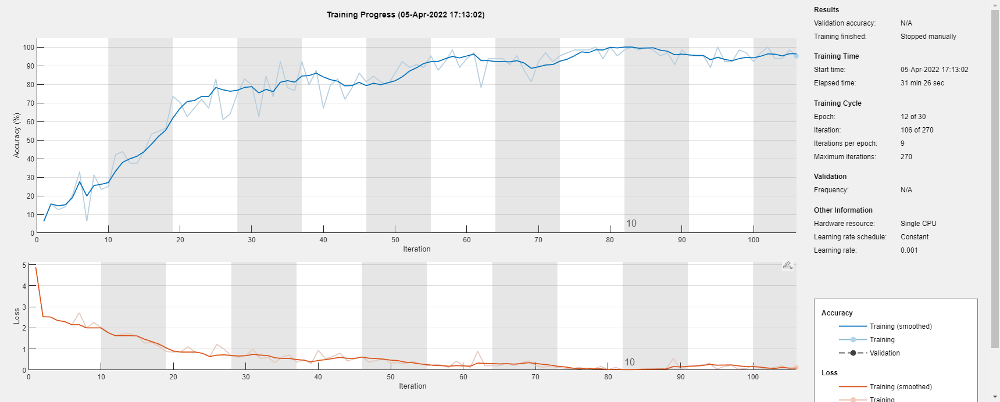

# **Machine Learning Sample**

- knn_sample01: 使用Knn模型將隨機0~2之間的數，分成類別0與1
- knn_sample02: 同knn_sample01, 模擬雷達迴波與氣溫兩個特徵，區分亮帶, 冰與水

# **Deep Learning Sample**

- pretrained_model01: 使用googlenet分類圖像的簡單範例 

- pretrained_model02: 使用resnet101分類圖像的簡單範例 

  
更多的pretrained model 可以查閱 APPS -> Deep Network designer

- trainsfer_model01: 使用googlenet model 訓練Flowers圖集 , 訓練結果可見 